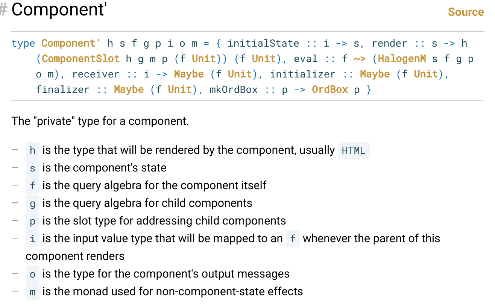

# History of Comonadic UIs

Phil Freeman wrote exploratory blog posts + a short paper about a novel way of creating UIs

. . .

Later Freeman would supervise a bachelor thesis by Arthur Xavier extending his orginal concept

. . .

This presentation is an overview of posts/papers on the subject thus far

----

# Comonads

## Whats a comonad? {.columns2}
- **Comonads** are dual structure to Monads
- Monads express effectful computations
- Comonads are values in some context

```haskell
class Comonad w where
  extract   :: w a -> a       -- copure
  duplicate :: w a -> w (w a) -- cojoin
```

<!-- Or that a value can be obtained -->
<!-- You've already got an a, you can extract it out at anytime. But there is a whole bunch of information AROUND the value that is also useful -->

----

# Extracting and Duplicating
- Using `extract`, we can extract the value that we were focusing on
<!-- extract is pretty intuitive here -->

{ width=30% }

. . .

- `duplicate` explodes out all the states of the transition
<!-- This is less obvious, some examples will be needed if you have never seena comonad before. -->

----

# NonEmpty List
```haskell
data NonEmptyList a = NonEmptyList a [a]

tail :: NonEmptyList a -> NonEmptyList a
tail (NonEmptyList _ xs) = NonEmptyList (head xs) (tail xs)

instance Comonad Zipper where
  extract (NonEmptyList x xs) = x
  duplicate neList = NonEmptyList neList allTails
    where ...
```

----

# NonEmpty Graph as a Comonad
```haskell
data NEGraph a = -- Complicated Stuff here

focusUpon :: NEGraph a -> a -> NEGraph a
focusUpon graph focus = -- TODO: focusUpon 

instance Comonad NEGraph where
    extract = -- TODO: extract
    duplicate graph = fmap (focusUpon graph) graph

```

----

# Comonads

## Other Comonads
* `Identity a`
* `(e, a)`
* Zippers
* `Trees with values in the branches (Cofree f)`
* Streams (But not *actual* streaming libraries)

----

# Uses for Comonads


Image processing is a natural fit for Cokliesli composition[^#]


```haskell
render :: FocusedImage Pixel -> Image
blur :: FocusedImage Pixel -> Pixel
lighten :: FocusedImage Pixel -> Pixel

lighten =>= blur =>= render
```

* Celullar automata
* Sudoku solvers


[^#]: https://jaspervdj.be/posts/2014-11-27-comonads-image-processing.html

----

# Component based UI

* Components are small, composable pieces of a UI
* They live in a hierarchy, the root component is the whole page
* These components pass messages, usually between parents and children
* They have their own internal state

. . .

* This usually requires a lot of type variables

----

# Component Example

```haskell
	data Component s = ...
```
<!-- But we also want it to input and output messages to the component -->

. . .


```haskell
	data Component s i o = ...
```
<!-- We also want to enumerate all the possible actions of the component can perform, call these q for Queries. And lets make it a functor so we can chuck it in a free monad -->

. . .

```haskell
	data Component s i o (q :: * -> *) = ...
```
<!-- But what about arbitrary effect? Can't forget that right? -->

. . .

```haskell
	data Component s i o (q :: * -> *) (m :: * -> *) = ...
```

# Component Example

Adding more type parameters for children, child query type, slot for addressing children yields



----

# Minimalist Components

* The only hard requirement is a rendering function

. . .

* But we also want all the fancy stuff
    * Mutable state
    * initialiser, finaliser
    * preloaded data
    * other effects, etc

----

# Components using Comonads
```haskell
type Component w = Comonad w => w UI
```
* `extract` will render the component
* `duplicate` will explore future states of a component
<!-- Draw up type of `Store s (Store s a)`, explain how this represents exploration -->

```haskell
extract :: Component w -> UI                  -- render
duplicate :: Component w -> w (Component w)   -- explode
select :: x -> w (Component w) -> Component w -- choose
```
<!-- Here we have `duplicate` (explosion) and `select`. -->
<!-- `select` is a function that takes something that selects a posible future from the model of all posible futures `w (w a)`, using a type called `x`.  -->
<!-- It's not clear that we can write a general `select` function that does what we want, or what `x` should be. We can start by saying that it should depend on `w` -->

Repeated application of `duplicate` and `select` gives us a way to manipulate the component, but it is not clear what `x` should be
<!-- Intuitivly, we want something that is the same size as the number of states that `Component w`. For every transition from state a to state b, there should be exactly one way of getting there.  -->

----

# Adjunctions
 - An adjuction is a relationship between two functors `f` and `g`.

```haskell
-- from Data.Functor.Adjunction (simplified)
class (Functor f, Functor g) => Adjunction f g where
  leftAdjunct :: (f a -> b) -> a -> g b
  rightAdjunct :: (a -> g b) -> f a -> b
```

- There are also a set of Adjunction laws

- If we require `Monad g` and `Comonad f`, this is looks like an isomorphism between `Kliesli g` and `Cokliesli f`


<!-- # Adjunctions
We don't get full isomorphism between the two, the adjoint laws are not strong enough.

So what do we get then?

```haskell
unit   :: Adjunction w m => a -> m (w a)
counit :: Adjunction w m => w (m a) -> a
``` -->

----

# Examples of Monad/Comonad Adjunctions

| Monad      | Comonad    |
| ---------- | ---------- |
| `Identity` | `Identity` |
| `Reader r` | `Env r`    |
| `State s`  | `Store s`  |
| `Writer w` | `Traced w` |
| `Free f`   | `Cofree f` |


We also have an adjuction between monad/comonad transformers
```haskell
instance Adjunction w m =>
  instance Adjunction (EnvT r w) (ReaderT r m)
```

----

# The Reader/Env Pairing
```haskell
type Reader r a = r -> a -- Monad m
type Env    r a = (a, r) -- Comonad w
```

. . .

Adjunction requirements:
```haskell
(w a -> b) -> (a -> m b)
(a -> m b) -> (w a -> b)
```
<!-- Go through the algebra to show that 1 is curry and 2 is uncurry -->

----

# An utterly surprising result! 
`m ()` can be used to navigate through `w a`

```haskell
select :: Adjunction w m => m () -> w (w a) -> w a
```

<!-- Go over example with the store monad -->

. . .

If `w` has a right adjunct `m`, we get a navigation type for free

----

# Overview
We have a new model for modeling UIs


```haskell
type Component w = w UI

extract :: Component w -> UI                     -- render
duplicate :: Component w -> w (Component w)      -- explode
select :: m () -> w (Component w) -> Component w -- choose
```

This is the bare minimum, we need much more than this 

----

## Other Gadgetry
* Sums of Components
* Products of Components
* Comonad Transformers
* Monads from Comonads (Action monads for free)
* Message Passing

----

# Comonadic Sum

A sum of comonads is itself a comonad

```haskell
-- from Data.Functor.Sum
data Sum f g a = InL (f a) | InR (g a)
instance (Comonad f, Comonad g) => Comonad (Sum f g) where
```

This would represent **two** UI components, with a single component visible at any given time.

For performance and ease of use, we need a comonad that can store both `f` and `g`.

----

# Comonadic Sum

From the paper **Declarative UIs are the Future - And the Future is Comonadic**, we get a different comonadic sum
```haskell
data Sum f g a = Sum Bool (f a) (g a)
instance (Comonad f, Comonad g) => Comonad (Sum f g) where ...
```

----

# Comonadic Product
A comonadic product is poses problems; it doesn't have a comonad instance

```haskell
-- from Data.Functor.Product
data Product f g a = Pair (f a) (g a)
```

----

# Comonadic Product 

Again from **The future is Comonadic**, Freeman suggests using `Day` to represent a comonadic product:

```haskell
-- from Data.Functor.Day
data Day f g a =
  Day (x -> y -> a) (f x) (g y)
instance Comonad f, Comonad g => Comonad (Day f g)
```

We can use the Day convolution to make combinators for UI components

```haskell
above, below, before, after :: f UI -> g UI -> Day f g UI
```

----

# Haskell Transformers
## Monad Transformers
```haskell
class MonadTrans t where
  lift :: Monad m => m a -> t m a
```

. . .

## Comonad Transformers
```haskell
class ComonadTrans t where
  lower :: Comonad w => t w a -> t a
```

<!-- These are homogenous transformers -->

----

# Comonad Transformer Stack

As with monads, comonad transformers also preserve comonad nature.

```haskell
data StoreT s w a = Store (w (s -> a)) s
```

. . .

As with monads, these transformers have classes so you don't have to dig through the stack

```haskell
class ComonadStore s w | w -> s where ...
```

----

# Monads from Comonads
`Co` is a heterogenous transformer

```haskell
data Co w a = Co { unCo :: w (a -> r) -> r }
instance Comonad w => Monad (Co w) where ...
```

. . .

<!-- Given a comonad `w`, `Co w` is a monad -->

Whats more, this new monad `Co w` is paired with `w`, meaning we get a way to move around `w a` for free.

----

# Parents and Children

Using `StoreT`, we can embed child comonads

```haskell
type Parent = StoreT s Child
```

We can also lift the actions for the child into actions for the parent

```haskell
liftAction :: ComonadTrans t => Co w a -> Co (t w) a 
```

----

# Co Zipper actions
Zippers are an example of an comonad with no obvious monad pairing.[^#]
<!-- Using Co to movearound the space of the zipper is a good choice here -->


```haskell
left :: Zipper a -> Zipper a
left (Zipper (l:ls) v rs) = Zipper ls l (v:rs)

-- type Co Zipper a = Co (Zipper (a -> r) -> r)

moveLeft :: Co Zipper ()
moveLeft = Co $ \z -> extract (left z) ()
```


[^#]: A Real-World Application with a Comonadic User Interface, Arthur Xavier, 2018

----

# Handling arbitrary effects
Given that `Co w` is a monad, why not add another parameter `m` for effects

```haskell 
newtype CoT w m a = CoT { runCoT :: w (a -> m r) -> m r }
```

Since `CoT w` is a monad transformer, we can lift arbitrary effects into

Unfortunatly `CoT w m a` does not pair with `w`. It is unknown how this might be solved.

----

# Message Passing
Use `Cofree f` as a base comonad, where `f` is a query algebra:

`Cofree f` is adjoint to `Free f`, so we have a very familiar way to sequence messages 

---

# Yet to be solved

## This model has some wrinkles:
* Message passing between components is not 
* `CoT w m a` does not pair with `w` anymore 


